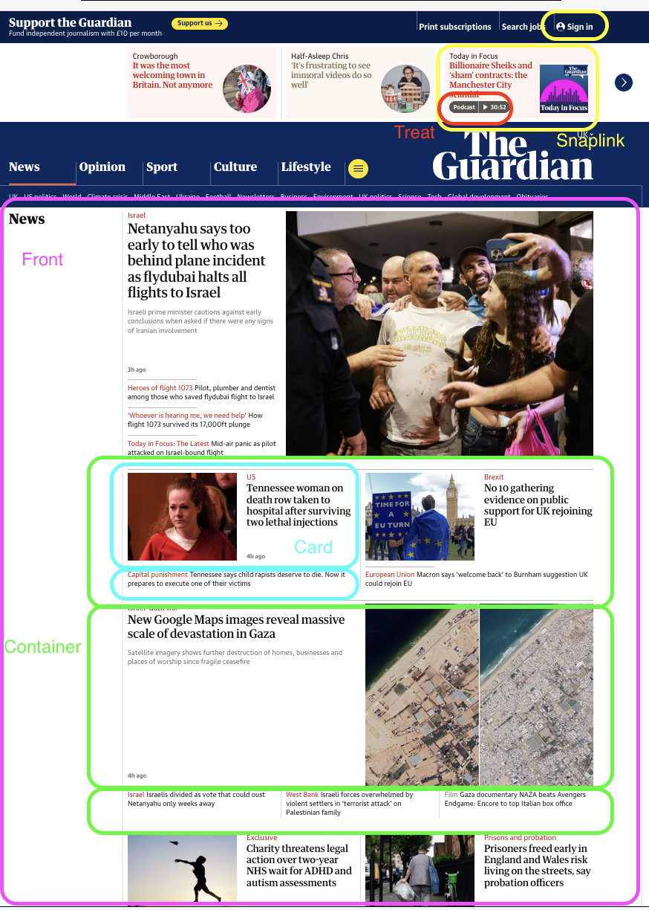
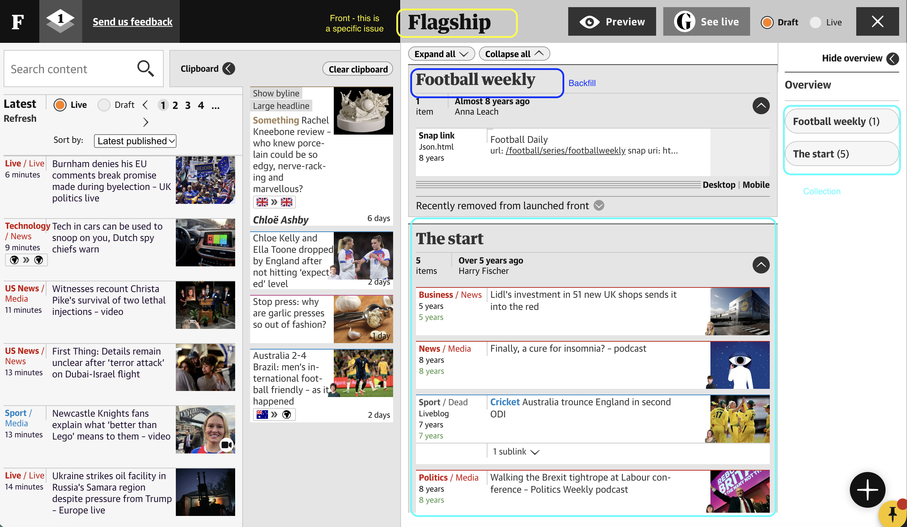
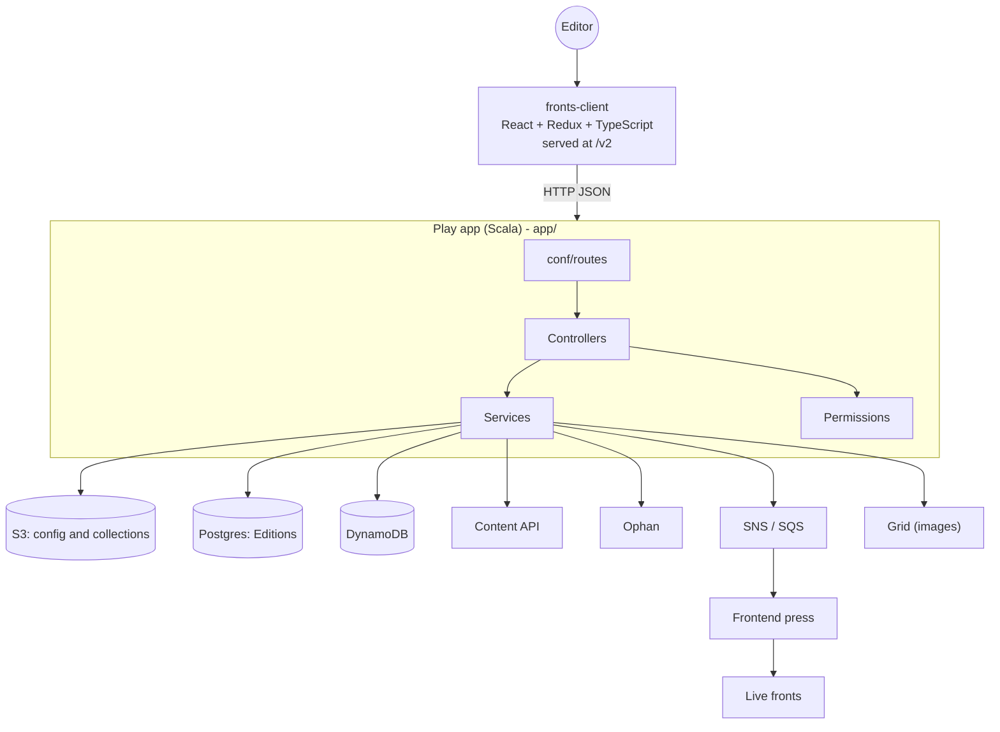
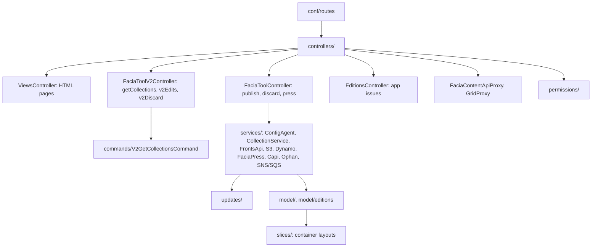
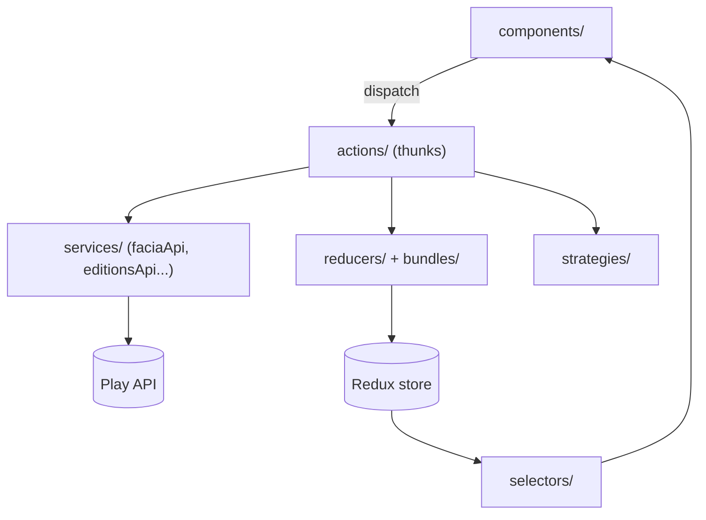

# What is a Front?

A Front is a page on theguardain.com, such as the home page and section pages.
The Fronts tool, which this repo owns, is used to create and edit these pages.

## Fronts key concepts

Key concepts in the Front itself are:

| Name | Description |
| --- | --- |
| Front | A curated page, made of containers |
| Container | A horizontal strip of a front. Its layout is set in the config tool. Different container types will present differently |
| Card | One item in a container such as an article or a snaplink. |
| Snaplink | A card that isn't an article. It can be a tag page, a website link or a custom HTML/JS bundle. |
| Treat | A small fixed item at the left of a container. |
| Thrasher | A container type holding custom, long-lived content. |

## Fronts tool key concepts

Key concepts in the Front tool are:

| Name | Description |
| --- | --- |
| Collection | A grouping of articles within a given Front. This essentially maps to a container (see above) |
| Press | Generates the JSON the website reads |
| Draft / Live | Editors work on a draft. Publishing makes the changes (Press) live |
| Backfill | Automatic content from a CAPI query by a given tag or set of tags .e.g "Ukraine". This fills a container after the manual cards |
| Edition | A different version of a front for different regions or platforms e.g. "The Daily Edition". It has a fixed structure and is like a template |
| Issue | A dated instance of an edition, e.g. "The Daily Edition for 2 October". |

# Codebase overview

## Components

This repo contains both the frontend and backend code, and integrates with many storage types and other services.

## Backend

This is the Scala Play app in app/. It handles authentication, permissions and storage. It also proxies CAPI and Grid.

## Frontend

This is fronts-client, a React/Redux single-page app. The older V1 UI still exists for the config tool and treats. V1Assets and V2Assets serve the two sets of static files.

strategies holds behaviour that differs between Fronts and Editions modes. Examples are fetch-collection.ts and update-collection.ts.
components/Editions/ is the app-issue UI.

