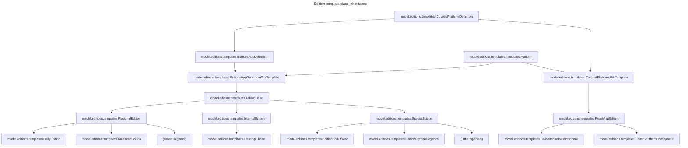
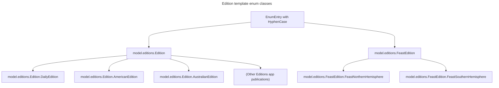

## Templating and Editions

From the [Glossary](Glossary.md) :
> Because an Edition is tied to a specific day (effectively, it's a specific instance), a user needs to be able to create one on-the-fly.  An Edition composes specific instances of Fronts which contain specific instances of Collections. A Template defines all of these relationships; it's used to generate an "empty" edition.  A Template is a concrete class in the codebase, which is called to perform this generation. Examples include DailyEdition, AmericanEdition, AustralianEdition, FeastNorthernHemisphere, FeastSouthernHemisphere.

The way that the class inheritance way comes together to build edition templates is a bit complex at first glance, so this doc is
an attempt to explain in a bit more detail what is going on.

### Backend code specifics - class inheritance
* An "Edition" can be intended for the Editions app; or it can be intended for the Feast app
* The only differences are in the templates used to build them and the backend chain to publish them
* The different backend chain necessitates differentiating them in code. This is done through trait inheritance.
* We introduced the more neutral term "Curated Platform" to refer to commonalities between the Editions app and the Feast app
* A separate instance of "Edition" is created (and saved to the database) when a user creates an edition for a day.  The template
  from which the Edition is created, is defined in code.
* These classes are defined under [app/model/editions/templates](../app/model/editions/templates).

`model.editions.CuratedPlatform` is an **enum** that lists all the types of `CuratedPlatform` (Editions and Feast, at the time of writing).

When a new Edition for a given date is created, then one of the concrete classes at the bottom of the diagram is used as the
factory to do the work.

Edition instances intended for the Editions app have a number of specific metadata fields, hence the need for `EditionsAppDefinition`
and its cousin `EditionsAppDefinitionWithTemplate` as opposed to the more generic `CuratedPlatformWithTemplate`.

### Backend code specifics - enums
Confusingly, the editions are _also_ defined as lists of enums.

The enums are defined in [app/model/editions/EditionsAppTemplates.scala](../app/model/editions/EditionsAppTemplates.scala)

This is so that the app's main menu can be built dynamically by the backend; the `HyphenCase` mixin is what defines
the edition names as seen by the frontend (`feast-northern-hemisphere`,`daily-edition`,`american-edition` etc.). The extra
level of separation between `Edition` and `FeastEdition` is needed
to ensure that the two sets are presented completely differently in the UI; this is a usability requirement for our curators
to ensure that they know which are "theirs" and which are used by other teams.

When the frontend makes a request to the backend for an instance of a given edition, this process happens:
- hyphencase keyword is passed to the backend as a URL parameter in a POST request
- `EditionsController` maps the string value to a concrete value of the enum, or returns an error if no such value exists
- Mappings in the `EditionsAppTemplates` and `FeastAppTemplates` static objects are used to map the enum value to a concrete
  template class
- Editions are generated by calling methods which are abstractly defined in `TemplatedPlatform` and implemented at a lower
  level (`FeastAppEdition`, `RegionalEdition` etc. usually)

The naming of the enum values is very close to the naming of the concrete classes, so make sure you know which is which!
The `EditionsAppTemplates` and `FeastAppTemplates` map one to the other.
