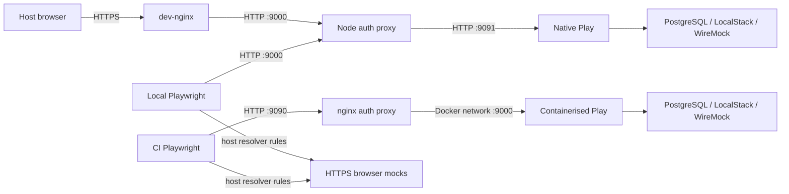

# Facia Tool end-to-end tests

This workspace runs Cucumber/Gherkin features with Playwright through
`playwright-bdd`. Testcontainers provides isolated PostgreSQL, LocalStack, and
WireMock dependencies on one machine. Play and Vite run natively during local
development and from a bind-mounted, toolchain-only container for `test:ci`.

## Local stack

The stack contains:

- PostgreSQL 10.7 for Play evolutions and Editions data.
- One LocalStack container for S3, DynamoDB, SNS, SQS, and STS.
- One shared `wiremock/wiremock` image instantiated for CAPI, Ophan, Grid,
  notifications, Recipes, and user telemetry.
- Synthetic pan-domain settings, permissions, front configuration, collection
  content, user data, and a CAPI article.

No Guardian repository dependency is checked out or run from source. Facia
Press and Editions downstream behavior stops at the locally seeded AWS
contracts.

Browser traffic always crosses a server-side authentication proxy. The proxy
adds the per-run signed pan-domain cookie and canonical tools Host/Origin
headers, so neither local browsers nor tests need forced cookies or browser
route mocks.



### Ports

| Port | Purpose |
| --- | --- |
| 9000 | Native development auth proxy and dev-nginx target |
| 9090 | Containerised `test:ci` auth proxy |
| 9091 | Direct Play port used for healthchecks |
| 5173 | Vite development server |
| 4567 | LocalStack host endpoint |
| 4725 | E2E PostgreSQL host endpoint |
| 9101-9106 | HTTP WireMock endpoints |
| 9143, 9145, 3133 | Grid, Recipes, and telemetry HTTPS mocks |

## Prerequisites

- Docker must be running.
- The repository dev container supplies Java, sbt, Node, Yarn, and mise.
- V2 dependencies must be installed in `fronts-client/`.
- No private repository access is required.

Install the e2e workspace:

```bash
cd e2e-tests
mise install
yarn install --frozen-lockfile
yarn playwright install chromium
```

For the host-browser flow, configure dev-nginx once from the repository root:

```bash
dev-nginx setup-app e2e-tests/fixtures/dev-nginx/nginx-mapping.yml
```

## Running the tests

Run commands from `e2e-tests/`.

| Command | Purpose |
| --- | --- |
| `yarn dev:local` | Start local dependencies, native Play/Vite, and the auth proxy in watch mode |
| `yarn test` | Run headlessly against an existing `dev:local` stack; abort if none exists |
| `yarn test:ui` | Open Playwright UI against an existing `dev:local` stack on port 9099 |
| `yarn test:ci` | Build the toolchain image, bind-mount the repository, start the complete container stack, run, and tear down |
| `yarn dev` | Run the repository's normal native development command against its configured dependencies |
| `yarn test:report` | Serve the HTML report from `target/playwright-report` on port 9098 |
| `yarn bddgen` | Generate Playwright tests from the feature files |
| `yarn typecheck` | Typecheck stack and step-definition code |

The fast local loop uses two terminals:

```bash
# Terminal 1
yarn dev:local

# Terminal 2
yarn test
```

Open `https://fronts.local.dev-gutools.co.uk/cookie` while `dev:local` is
running. The server-side proxy authenticates the browser and redirects `/` to
the V2 landing page.

Playwright output, traces, screenshots, videos, generated tests, build contexts,
and downloaded intermediate files live under `e2e-tests/target/` or other
gitignored generated paths.

## Folder structure

```text
e2e-tests/
├── features/                 Gherkin features
├── steps/                    Shared fixtures and Playwright step definitions
├── setup/                    Stack lifecycle, auth, seeding, and local runner
│   └── stack/                App, LocalStack, PostgreSQL, and WireMock recipes
├── fixtures/
│   ├── app-config/           Synthetic Play and AWS configuration
│   ├── capi/                 WireMock mappings and synthetic CAPI article
│   ├── dynamodb/             Open-front user data
│   ├── fronts/               Front, collection, and switchboard objects
│   ├── permissions/          Synthetic permission grants
│   ├── pan-domain-settings/  Base settings extended with per-run RSA keys
│   └── */mappings/           Other WireMock stubs
├── images/                   Toolchain-only app image and entrypoint
├── global-setup.ts           Owned/shared stack selection and teardown
├── playwright.config.ts      BDD and browser configuration
├── package.json
└── yarn.lock
```

## How a run works

1. `bddgen` turns `features/**/*.feature` into generated Playwright tests.
2. `global-setup.ts` reuses `.dev-local-stack.json`, or owns a complete stack for
   `test:ci`.
3. Testcontainers creates one network, starts PostgreSQL and LocalStack, seeds
   AWS, and starts every WireMock from the same image.
4. Local development starts Play and Vite as native child processes. `test:ci`
   builds a tiny toolchain image context under `target/` and bind-mounts the
   repository into the app container.
5. A server-side proxy supplies pan-domain authentication for every request.
6. Playwright runs the generated scenarios and global teardown stops owned
   containers and networks.

## Writing tests

Feature files follow
`.github/instructions/feature-files.instructions.md` and include evidence paths
after every scenario. Add step definitions under `steps/` using the shared
fixtures and user-facing Playwright locators.

To add an upstream mock:

1. Add `fixtures/<service>/mappings/` and optional `__files/` responses.
2. Add one entry to `MOCK_CONFIGS` in `setup/constants.ts`.
3. Use a Docker network alias for server calls. Add a browser resolver rule only
   for cross-origin browser HTTPS calls.
4. Keep all fixture identities and credentials synthetic.
