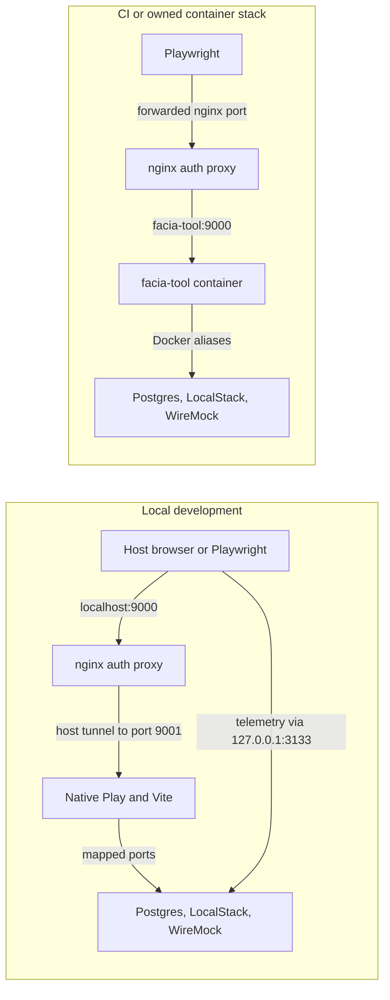

<!-- guardian-agent-skill: e2e-test-setup/v1 -->
# End-to-end tests

This suite runs Cucumber/Gherkin feature files with Playwright through
`playwright-bdd`. The harness runs the real facia-tool application natively for
local development or in a container for CI, while Testcontainers starts its
local dependencies. Postgres and LocalStack provide state, and WireMock stands
in for upstream HTTP services. Everything runs on one machine, with no deployed
Guardian services required, so the same setup can run locally and in CI.

## Local stack

Testcontainers creates an isolated Docker network for each stack. It starts
Postgres 17, LocalStack, nine WireMock containers from one shared image, and
an nginx authentication reverse proxy.
LocalStack provides S3, DynamoDB, SQS, SNS, STS, and CloudWatch. WireMock stands
in for Content API, Ophan, Recipes, Grid, mobile notifications, pan-domain
authentication, video, user telemetry, and Pinboard. No Guardian-owned service
is checked out or run separately.

In local development, Play and Vite run as native watch processes while the
dependencies and nginx run in Docker. A host browser or Playwright connects to
nginx at `http://localhost:9000`; nginx's `/cookie` endpoint issues an ephemeral,
locally signed pan-domain cookie and redirects to `/v2`. All other paths are
forwarded to native Play on port 9001 using Testcontainers' host-port tunnel.
The main application has no e2e authentication endpoint or cookie configuration.
Cookies are host-only, HttpOnly, and SameSite=Lax; Secure is added when an outer
TLS proxy supplies `X-Forwarded-Proto: https`.
Server-side calls use the dynamically
forwarded Testcontainers ports. Browser telemetry requests use Playwright's
`--host-resolver-rules` to reach the WireMock HTTPS port at `127.0.0.1:3133`.
Unlike the regular development environment, the e2e stack does not route
through dev-nginx or `fronts.local.dev-gutools.co.uk`.

In CI mode, facia-tool also runs in Docker from a toolchain-only image. The
working tree is bind-mounted at `/workspace`, and the app reaches dependencies
through Docker network aliases. Playwright uses nginx's randomly mapped port;
nginx forwards to `facia-tool:9000` on the Docker network. Play's mapped port is
retained for direct diagnostic probes. Vite uses port 5173 in both modes.


```mermaid
flowchart LR
  subgraph Local[Local development]
    Host[Host browser or Playwright] -->|localhost:9000| Proxy[nginx auth proxy]
    Proxy -->|host tunnel to port 9001| Native[Native Play and Vite]
    Native -->|mapped ports| LocalDeps[Postgres, LocalStack, WireMock]
    Host -->|telemetry via 127.0.0.1:3133| LocalDeps
  end

  subgraph CI[CI or owned container stack]
    Runner[Playwright] -->|forwarded nginx port| CiProxy[nginx auth proxy]
    CiProxy -->|facia-tool:9000| App[facia-tool container]
    App -->|Docker aliases| CiDeps[Postgres, LocalStack, WireMock]
  end
```

All AWS clients receive dummy credentials and explicit LocalStack endpoints.
Generated runtime configuration, keys, connection metadata, reports, and build
contexts are written under `target/` and are not committed.

## Prerequisites

- Docker must be running and accessible to the current user.
- Use the repository dev container, or install the versions in the root and e2e
  `.tool-versions` files, including Node, Yarn 1, Java, and sbt.
- Install the e2e dependencies with `yarn install --frozen-lockfile` from this
  directory. On Linux ARM64, the test runner downloads the pinned Chromium pack
  on first use and caches it in the system temporary directory.
- No private repository checkout, SSH access, Guardian credentials, or AWS
  credentials are needed.

## Running the tests

Run commands from `e2e-tests/`.

For the fastest local loop, start one shared stack and leave it running:

```sh
yarn dev:local
```

This starts Postgres, LocalStack, all mocks, Vite, Play, and nginx, then waits until
`http://localhost:9000/_healthcheck` succeeds. Open
`http://localhost:9000/cookie` in a host browser to authenticate and land on
the Fronts Tool at `/v2`. Stop the stack with `Ctrl+C`.

In another terminal, reuse that stack for a headless test run:

```sh
yarn test
```

`yarn test` deliberately fails when no healthy shared local stack is running.
It generates Playwright tests from the feature files and then runs them.

Other commands:

| Command | Purpose |
| --- | --- |
| `yarn test:ci` | Build an owned app container, start an isolated stack, run the complete suite, and tear the stack down. |
| `yarn test:ui` | Start an owned native-app stack and launch Playwright UI mode; it requires a usable host display or forwarded UI port. |
| `yarn test:report` | Serve the last local HTML report at `http://localhost:9098`. |
| `yarn bddgen` | Generate Playwright test files under `.features-gen/` without running a browser. |
| `yarn typecheck` | Type-check the e2e TypeScript. |
| `yarn validate:auth` | Check nginx cookie issuance, native routing, headers, request bodies, and WebSocket upgrades against a local test server; requires Docker and free ports 9000/9001, but no app or AWS services. |
| `yarn validate:fixtures` | Verify fixture structure, seed data, WireMock mappings, and expected synthetic values. |
| `yarn validate:stack` | Start and probe the complete stack, check AWS isolation and logs, then check cleanup. |
| `yarn dev` | Start the repository's regular development environment against remote services; do not run e2e tests against it. |

Local HTML reports are written to `target/playwright-report/`. Screenshots,
videos, traces, and other Playwright output are written to
`target/test-results/`. Traces and videos are retained on the first retry, and
screenshots are retained on failure.

## Continuous integration

`.github/workflows/e2e-tests.yml` runs the complete suite for pull requests,
pushes to `main`, and manual dispatches. The job uses `ubuntu-22.04`, caches the
Yarn dependencies, installs only Playwright's Chromium headless shell, and runs
`yarn test:ci`. Testcontainers builds the app image and owns the isolated stack;
the workflow does not use service containers, remote Guardian services, AWS
credentials, or private repository credentials.

If the job fails, GitHub Actions uploads `target/test-results/` as the
`playwright-failure-artifacts` artifact and retains it for seven days. This
directory contains any screenshots, traces, and videos retained by Playwright.
All third-party actions in the workflow are pinned to immutable commit SHAs.

## Folder structure

```text
e2e-tests/
├── features/             # Gherkin features and evidence comments
├── fixtures/
│   ├── auth-redirect/    # nginx cookie endpoint and reverse-proxy template
│   ├── dynamodb/         # DynamoDB items
│   ├── pan-domain/       # Synthetic pan-domain settings
│   ├── s3/               # S3 objects, mirroring bucket/key paths
│   └── wiremock/         # One mappings/__files root per mocked service
├── images/               # Toolchain-only facia-tool Dockerfile
├── scripts/              # Test runner and repeatable validation scripts
├── setup/
│   ├── stack/            # Infrastructure, app, mock, bootstrap, and config recipes
│   ├── panDomain.ts      # Ephemeral keys and signed auth cookie
│   ├── run-dev-local.ts  # Long-lived shared local stack
│   ├── sharedStack.ts    # Gitignored stack connection metadata
│   └── stackContainers.ts# Stack lifecycle coordinator
├── steps/                # playwright-bdd fixtures and step definitions
├── target/               # Generated runtime files, build contexts, and reports
├── global-setup.ts       # Shared-stack reuse or owned-stack lifecycle
├── package.json          # Commands and pinned test dependencies
├── playwright.config.ts  # BDD generation, browser, retries, and reporters
└── tsconfig.json
```

`.features-gen/` is generated by `playwright-bdd` and is also gitignored.

## How a test run fits together

1. `scripts/run-tests.ts` checks that feature files exist, configures Chromium,
   and runs `bddgen`.
2. Playwright calls `global-setup.ts`. It reuses the healthy stack recorded by
   `dev:local`, or starts an owned stack for `test:ci` and `test:ui`.
3. The stack creates its network and infrastructure, seeds LocalStack, starts
  WireMock, writes generated runtime configuration, and starts facia-tool.
  It then starts nginx and publishes the proxy URL as the stack's base URL.
4. The custom fixture in `steps/fixtures.ts` reads the active stack connection;
   background steps check health and authenticate through `/cookie`.
5. Generated Playwright tests execute the Gherkin scenarios. Owned stacks are
   torn down after the run; shared stacks remain available for the next run.

## Writing tests

Add behaviour to `features/*.feature` and implement matching steps under
`steps/`. Keep scenarios user-focused and add `# Evidence:` comments that point
to the templates or client code establishing each behaviour. Reuse the shared
background steps for stack health and pan-domain sign-in; `/cookie` uses a new
ephemeral keypair for every stack, so tests must not hard-code cookies or keys.
Cookie issuance lives only in `fixtures/auth-redirect/default.conf.template`
and `setup/stack/auth-redirect.ts`, not in the application's controllers or routes.

To add or change seeded AWS state, put synthetic source data under
`fixtures/s3/` or `fixtures/dynamodb/` and update `setup/stack/bootstrap.ts`.
To add an HTTP mock, create
`fixtures/wiremock/<service>/mappings/` and, when needed, an adjacent
`__files/` response, then register the service and its network aliases in
`setup/stack/mocks.ts`. Point server-side application configuration at it in
`setup/stack/runtime-config.ts`; add a browser host resolver rule only when the
browser itself calls that hostname.

Run `yarn validate:fixtures`, `yarn typecheck`, and `yarn bddgen` before running
the affected feature or full suite. Keep this README synchronized whenever the
stack, fixtures, commands, folder layout, or CI behaviour changes.